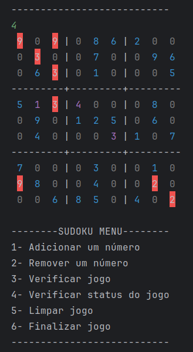

# Sudoku Projeto 🧩


Projeto de Sudoku jogável diretamente pelo terminal, desenvolvido em Java com foco em aprendizagem de Programação Orientada ao Objeto

## Funcionalidades

- Leitura de tabuleiro inicial via linha de comando (com casas fixas)
- Inserção e remoção de valores nas casas
- Verificação de jogadas válidas (bloco, linha e coluna)
- Detecção de casas com erro e exibição destacada no terminal
- Limpeza do tabuleiro mantendo apenas casas fixas
- Verificação automática de vitória (tabuleiro completo e válido)


### Principais Classes

| Classe       | Responsabilidade Principal |
|--------------|-----------------------------|
| `Partida`    | Controla a lógica do jogo    |
| `Tabuleiro`  | Gerencia os blocos e casas   |
| `Bloco`      | Representa um dos 9 blocos   |
| `Casa`       | Representa uma célula        |
| `Jogada`     | Representa a ação do jogador |
| `Verificador...` | Validam regras específicas |
| `Menu` | Controla a interface |
| `SudokuController`| Controla o fluxo do jogo |

##  Como jogar

### Compilar o projeto

```bash
javac -d bin src/**/*.java
```

### Executar o jogo
Passe as casas fixas via argumento no seguinte formato:
```bash
java -cp bin Master "0,0;5,true" "1,1;7,true"
```
Onde:

0,0 = posição (coluna, linha)

5 = valor

true = casa fixa (não pode ser apagada)

## Demonstração



Casas com erro são destacadas com cores (requer terminal compatível).

## Futuras melhorias
- Testes unitários com JUnit

- Sistema de salvar e carregar partidas

- Interface gráfica (Web)

- Modo resolução automática
